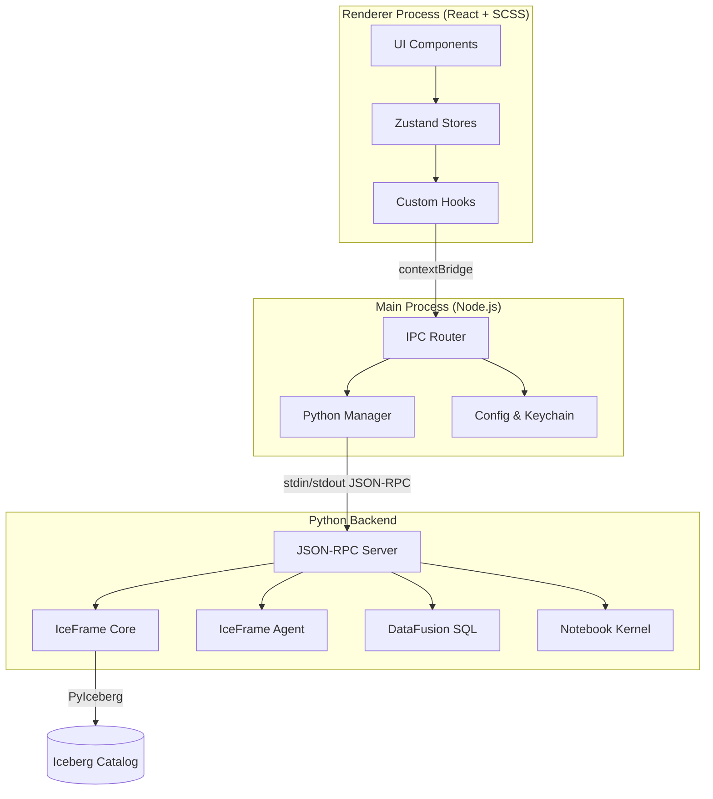
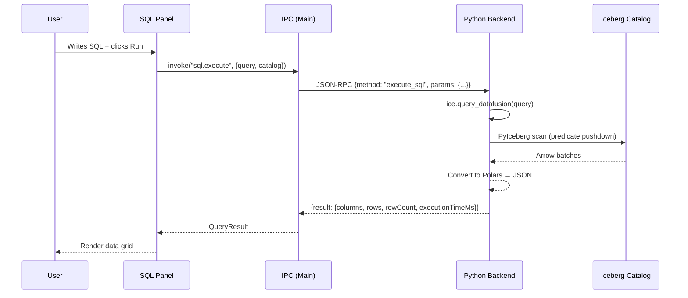
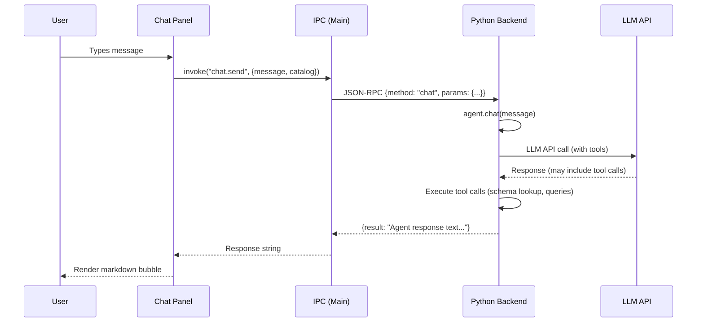
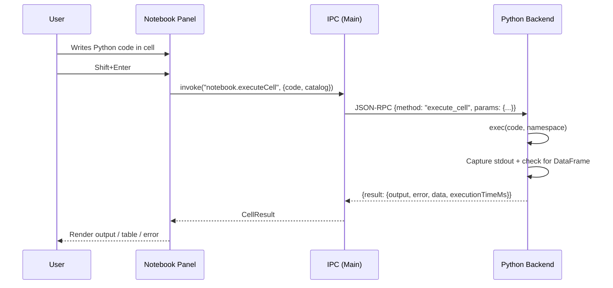
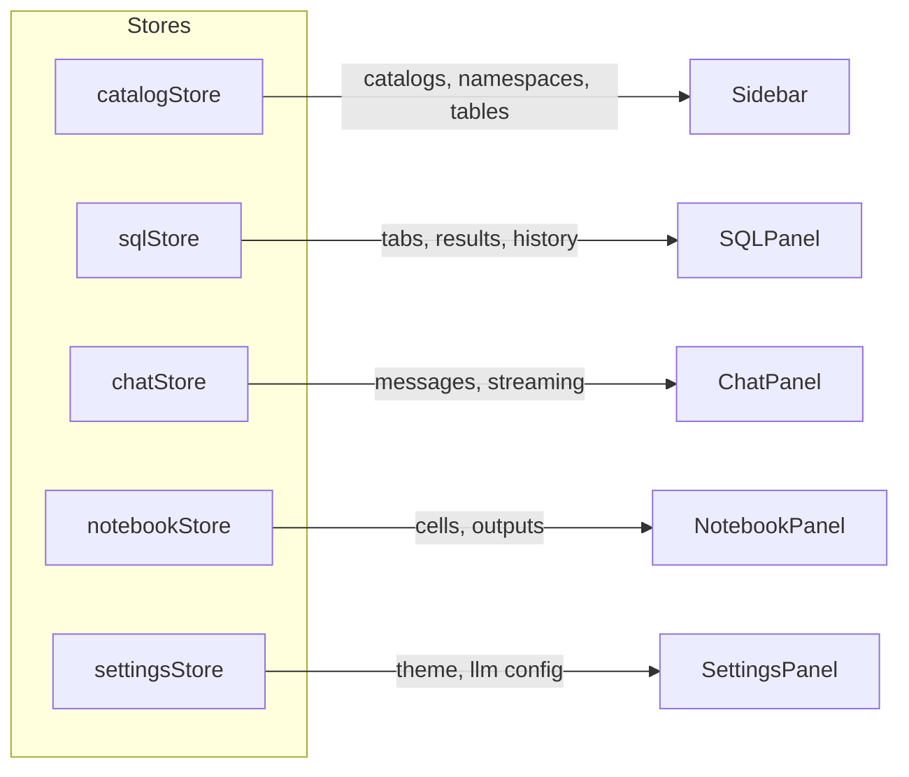
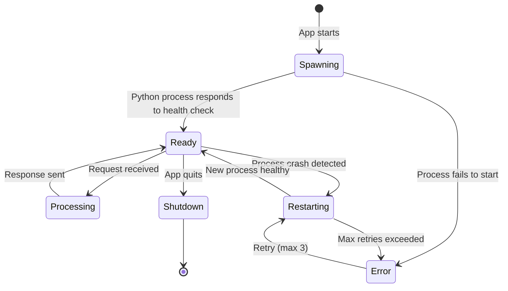

# IceTop — System Architecture

## 1. Overview

IceTop follows a **three-layer architecture** connecting the Electron renderer, the Electron main process, and an embedded Python backend.



---

## 2. Layer Responsibilities

### 2.1 Renderer Process

| Module | Responsibility |
|---|---|
| **Sidebar** | Displays catalog tree; supports expand/collapse, context menus, drag source |
| **Chat Panel** | Chat UI with message history, markdown rendering, streaming response |
| **SQL Panel** | Monaco editor for SQL; results grid; query tabs; history |
| **Notebook Panel** | Cell-based editor; Python & Markdown cells; inline output |
| **Settings Panel** | Form for LLM config, Python path, theme toggle |
| **Zustand Stores** | Client-side state: catalog tree cache, open tabs, chat history, settings |

### 2.2 Main Process

| Module | Responsibility |
|---|---|
| **Window Manager** | Creates and manages the BrowserWindow; handles app lifecycle |
| **IPC Router** | Receives `invoke` calls from renderer; dispatches to Python or local handlers |
| **Python Manager** | Spawns, monitors, and restarts the Python child process |
| **Config Store** | Reads/writes `~/.icetop/settings.json`; interfaces with `safeStorage` |

### 2.3 Python Backend

| Module | Responsibility |
|---|---|
| **JSON-RPC Server** | Reads stdin line-by-line; dispatches to handlers; writes JSON to stdout |
| **Catalog Handler** | Loads `~/.pyiceberg.yaml`; creates `IceFrame` instances per catalog |
| **SQL Handler** | Calls `ice.query_datafusion()` and converts results to JSON |
| **Chat Handler** | Wraps `IceFrameAgent`; supports multi-turn conversation |
| **Notebook Handler** | Maintains a persistent Python namespace; executes cells via `exec()` |
| **Config Loader** | Parses PyIceberg YAML; resolves env var overrides |

---

## 3. Data Flow Diagrams

### 3.1 SQL Query Execution



### 3.2 Chat Message



### 3.3 Notebook Cell Execution



---

## 4. State Management



Each store is independent and follows the pattern:

```typescript
interface SQLStore {
  tabs: SQLTab[];
  activeTabId: string;
  history: QueryHistoryItem[];
  // Actions
  addTab: () => void;
  closeTab: (id: string) => void;
  executeQuery: (tabId: string) => Promise<void>;
}
```

---

## 5. Python Process Lifecycle



The Python Manager:
- Spawns `python3 -u server.py` with unbuffered output
- Sends a health check `{"method": "ping"}` on startup
- Monitors the process and auto-restarts on crash (up to 3 retries)
- Gracefully terminates on app quit

---

## 6. Key Design Decisions

| Decision | Rationale |
|---|---|
| **Python child process (not REST server)** | Avoids port conflicts and firewall issues; stdin/stdout is simpler and lower latency |
| **JSON-RPC over stdin/stdout** | Language-agnostic, lightweight, supports request-response and streaming |
| **One Python process per app** | Multiple `IceFrame` instances (one per catalog) live in the same process for efficient resource sharing |
| **Monaco Editor** | Same engine as VS Code; excellent SQL and Python support out of the box |
| **Zustand over Redux** | Minimal boilerplate; IceTop's state is straightforward enough for Zustand |
| **SCSS Modules** | Scoped styles prevent leaks; SCSS variables align with design system tokens |
| **Polars DataFrames → JSON** | Conversion happens server-side; frontend receives plain JSON arrays for grid rendering |
